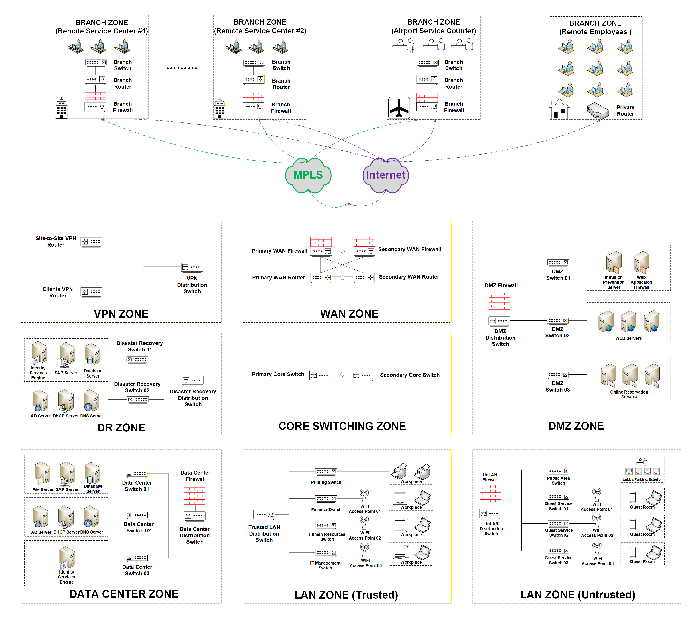

# Cisco Classic Hierarchical Architecture Lab

## Overview

This diagram illustrates a comprehensive enterprise network architecture that integrates branch connectivity, data center services, security zoning, and user access segmentation. The design adopts a hierarchical and zone-based approach to ensure scalability, resiliency, and strong security enforcement across different functional domains.

At the edge, multiple branch sites (including remote offices, service centers, and airport counters) connect to the enterprise network through a hybrid WAN infrastructure leveraging both MPLS and Internet transport. This dual connectivity model enables redundancy, improved availability, and flexible traffic engineering. Branch routers and firewalls provide local breakout and secure access into the enterprise network.

The WAN Zone serves as the aggregation point for external connectivity, incorporating redundant routers and firewalls to provide high availability and secure ingress into the core network. In parallel, the VPN Zone supports both site-to-site and client-based VPN services, enabling secure remote access for users and external connections.

At the center of the architecture, the Core Switching Zone provides high-speed Layer 3 forwarding and acts as the backbone interconnecting all major zones. It is designed to remain simple and resilient, focusing on fast packet transport rather than policy enforcement.

The Data Center Zone hosts critical enterprise services such as application servers, databases, and identity services (e.g., AD, DNS, DHCP). A dedicated data center firewall enforces security policies for traffic entering or leaving the server environment. A separate Disaster Recovery (DR) Zone ensures business continuity by maintaining replicated services and backup infrastructure.

The DMZ Zone is designed to host externally accessible services, including web servers and application gateways, protected by dedicated firewalls and intrusion prevention systems. This zone isolates public-facing services from internal networks while allowing controlled access.

User access is divided into two distinct domains: the Trusted LAN Zone, which supports internal employees and corporate devices with controlled access to enterprise resources, and the Untrusted LAN Zone, which provides segmented access for guests and public users, strictly isolated through dedicated firewalls and access policies.

Overall, this architecture demonstrates a layered security model combined with modular network design, enabling efficient traffic flow, strong isolation between trust zones, and high availability across both campus and data center environments.

This repository includes topology diagrams, device configurations, and validation commands used to build and test the environment.

---

## Topology

The Visio network diagram shown above illustrates the overall architecture of this lab environment.

---

# Enterprise Network IP Scheme

## 1. WAN Zone

| Segment | VLAN ID | Subnet | Default Gateway | Purpose |
|---------|---------|--------|-----------------|---------|
| WAN Transit 1 | 10 | 10.0.10.0/30 | N/A | Primary WAN router to firewall transit |
| WAN Transit 2 | 11 | 10.0.10.4/30 | N/A | Secondary WAN router to firewall transit |
| MPLS Edge | 12 | 10.0.12.0/30 | N/A | MPLS provider edge connectivity |
| Internet Edge | 13 | 10.0.13.0/30 | N/A | Internet edge connectivity |

---

## 2. VPN Zone

| Segment | VLAN ID | Subnet | Default Gateway | Purpose |
|---------|---------|--------|-----------------|---------|
| Site-to-Site VPN | 20 | 10.0.20.0/24 | 10.0.20.1 | Site-to-site VPN services |
| Client VPN Pool | 21 | 10.0.21.0/24 | 10.0.21.1 | Remote access VPN clients |
| VPN Management | 22 | 10.0.22.0/24 | 10.0.22.1 | VPN device management |

---

## 3. Core Switching Zone

| Segment | VLAN ID | Subnet | Default Gateway | Purpose |
|---------|---------|--------|-----------------|---------|
| Core Infrastructure | 30 | 10.0.30.0/24 | 10.0.30.1 | Core switch loopbacks / infrastructure |
| Core Management | 31 | 10.0.31.0/24 | 10.0.31.1 | Core device management |

---

## 4. DMZ Zone

| Segment | VLAN ID | Subnet | Default Gateway | Purpose |
|---------|---------|--------|-----------------|---------|
| DMZ Web Servers | 40 | 172.16.40.0/24 | 172.16.40.1 | Public web servers |
| DMZ Application Services | 41 | 172.16.41.0/24 | 172.16.41.1 | Application firewall / service nodes |
| DMZ Reservation Systems | 42 | 172.16.42.0/24 | 172.16.42.1 | Online reservation servers |
| DMZ Security Services | 43 | 172.16.43.0/24 | 172.16.43.1 | IPS / security appliances |

---

## 5. Data Center Zone

| Segment | VLAN ID | Subnet | Default Gateway | Purpose |
|---------|---------|--------|-----------------|---------|
| DC Server Farm | 50 | 192.168.50.0/24 | 192.168.50.1 | General application servers |
| DC Database Servers | 51 | 192.168.51.0/24 | 192.168.51.1 | Database servers |
| DC SAP Servers | 52 | 192.168.52.0/24 | 192.168.52.1 | SAP servers |
| DC Identity Services | 53 | 192.168.53.0/24 | 192.168.53.1 | AD / DNS / DHCP / ISE |
| DC Management | 54 | 192.168.54.0/24 | 192.168.54.1 | Data center switch / firewall management |

---

## 6. Disaster Recovery Zone

| Segment | VLAN ID | Subnet | Default Gateway | Purpose |
|---------|---------|--------|-----------------|---------|
| DR Server Farm | 60 | 192.168.60.0/24 | 192.168.60.1 | DR application servers |
| DR Database Servers | 61 | 192.168.61.0/24 | 192.168.61.1 | DR database servers |
| DR SAP Servers | 62 | 192.168.62.0/24 | 192.168.62.1 | DR SAP servers |
| DR Identity Services | 63 | 192.168.63.0/24 | 192.168.63.1 | DR AD / DNS / DHCP / ISE |
| DR Management | 64 | 192.168.64.0/24 | 192.168.64.1 | DR switch / firewall management |

---

## 7. Trusted LAN Zone

| Segment | VLAN ID | Subnet | Default Gateway | Purpose |
|---------|---------|--------|-----------------|---------|
| Finance Department | 70 | 192.168.70.0/24 | 192.168.70.1 | Finance users |
| Human Resources | 71 | 192.168.71.0/24 | 192.168.71.1 | HR users |
| IT Management | 72 | 192.168.72.0/24 | 192.168.72.1 | IT admin users |
| Printing Services | 73 | 192.168.73.0/24 | 192.168.73.1 | Printers and print services |
| Trusted Wireless | 74 | 192.168.74.0/24 | 192.168.74.1 | Internal corporate Wi-Fi |

---

## 8. Untrusted LAN Zone

| Segment | VLAN ID | Subnet | Default Gateway | Purpose |
|---------|---------|--------|-----------------|---------|
| Guest Wireless | 80 | 192.168.80.0/24 | 192.168.80.1 | Guest Wi-Fi users |
| Public Area Access | 81 | 192.168.81.0/24 | 192.168.81.1 | Lobby / parking / public-area devices |
| Guest Service Network | 82 | 192.168.82.0/24 | 192.168.82.1 | Guest service terminals |
| Temporary Devices | 83 | 192.168.83.0/24 | 192.168.83.1 | Temporary / unmanaged devices |

---

## 9. Branch Zones

| Segment | VLAN ID | Subnet | Default Gateway | Purpose |
|---------|---------|--------|-----------------|---------|
| Branch 1 Users | 101 | 192.168.101.0/24 | 192.168.101.1 | Remote service center #1 users |
| Branch 2 Users | 102 | 192.168.102.0/24 | 192.168.102.1 | Remote service center #2 users |
| Airport Counter | 103 | 192.168.103.0/24 | 192.168.103.1 | Airport counter users |
| Remote Employees | 104 | 192.168.104.0/24 | 192.168.104.1 | Home/remote employees |
| Branch Management | 105 | 192.168.105.0/24 | 192.168.105.1 | Branch device management |

---

## 10. Management and Infrastructure

| Segment | VLAN ID | Subnet | Default Gateway | Purpose |
|---------|---------|--------|-----------------|---------|
| Network Management | 200 | 10.10.200.0/24 | 10.10.200.1 | Network device management |
| Server Management | 201 | 10.10.201.0/24 | 10.10.201.1 | Server out-of-band / management |
| Monitoring / Logging | 202 | 10.10.202.0/24 | 10.10.202.1 | Syslog, SNMP, NetFlow, monitoring |
| Backup Services | 203 | 10.10.203.0/24 | 10.10.203.1 | Backup and recovery services |

---

## Device Configuration 
Please refer to project folder.
